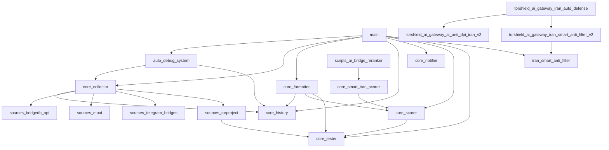

# Tor-Bridges-Collector Architecture Documentation

> Auto-generated by `scripts/generate_architecture_docs.py`

## 1. Project Overview

Tor-Bridges-Collector is a comprehensive bridge intelligence platform that collects, scores, tests, and distributes Tor bridge addresses with special emphasis on anti-censorship capabilities for Iran. The system integrates multiple AI providers (Cerebras, Cloudflare AI Gateway, Cloudflare Workers AI, Portkey) with intelligent fallback routing, circuit breakers, and a LocalAIEngine for zero-dependency degraded mode.

## 2. Project Statistics

| Metric | Value |
|--------|-------|
| Python Files | 70 |
| Total Lines | 30,766 |
| Classes | 84 |
| Functions | 294 |
| Internal Dependencies | 24 |

### 2.1 Code Distribution by Directory

| Directory | Files | Lines | Classes | Functions |
|-----------|-------|-------|---------|-----------|
| `(root)/` | 30 | 12,179 | 18 | 199 |
| `core/` | 12 | 3,006 | 12 | 12 |
| `monitoring/` | 3 | 1,125 | 10 | 0 |
| `scripts/` | 6 | 2,594 | 5 | 27 |
| `sources/` | 8 | 1,864 | 0 | 56 |
| `torshield_ai_gateway/` | 11 | 9,998 | 39 | 0 |

## 3. Architecture Layers

The project follows a layered architecture with clear separation of concerns:

```
┌─────────────────────────────────────────────────────────┐
│                   CI/CD Layer (GitHub Actions)          │
│  ┌──────────────┐ ┌──────────────┐ ┌──────────────────┐ │
│  │ Quality Gate │ │ Health Check │ │ Self-Healing CI  │ │
│  └──────────────┘ └──────────────┘ └──────────────────┘ │
├─────────────────────────────────────────────────────────┤
│                  Application Layer (main.py)             │
│  ┌──────────┐ ┌────────────┐ ┌──────────────┐          │
│  │ Scraper  │ │ Reranker   │ │ Results      │          │
│  └──────────┘ └────────────┘ └──────────────┘          │
├─────────────────────────────────────────────────────────┤
│                   AI Gateway Layer                       │
│  ┌──────────────────────────────────────────────────┐   │
│  │           TorShieldAIGateway (waterfall)          │   │
│  │  Cerebras → CF-Gateway → CF-Workers → Portkey    │   │
│  │       → LocalAIEngine (fallback)                  │   │
│  └──────────────────────────────────────────────────┘   │
│  ┌──────────────┐ ┌───────────────┐ ┌──────────────┐   │
│  │ Model        │ │ Circuit       │ │ Account      │   │
│  │ Selector     │ │ Breaker       │ │ Rotator      │   │
│  └──────────────┘ └───────────────┘ └──────────────┘   │
├─────────────────────────────────────────────────────────┤
│              Anti-Censorship Layer (Iran)                │
│  ┌──────────────┐ ┌───────────────┐ ┌──────────────┐   │
│  │ Smart Anti-  │ │ Anti-DPI v2   │ │ Auto-Defense │   │
│  │ Filter v2    │ │ (AI-powered)  │ │ v3           │   │
│  └──────────────┘ └───────────────┘ └──────────────┘   │
│  ┌──────────────┐ ┌───────────────┐ ┌──────────────┐   │
│  │ Smart Bypass │ │ NIN Bypass    │ │ DPI Quantum  │   │
│  │ Engine       │ │               │ │ Evasion      │   │
│  └──────────────┘ └───────────────┘ └──────────────┘   │
├─────────────────────────────────────────────────────────┤
│                 Core Bridge Collection Layer             │
│  ┌──────────┐ ┌──────────┐ ┌──────────┐ ┌──────────┐ │
│  │ Collector│ │ Formatter│ │ Scorer   │ │ Tester   │ │
│  └──────────┘ └──────────┘ └──────────┘ └──────────┘ │
│  ┌──────────┐ ┌──────────┐ ┌──────────┐ ┌──────────┐ │
│  │ Notifier │ │ History  │ │ Iran     │ │ Censor-  │ │
│  │          │ │          │ │ Detector │ │ ship Mon │ │
│  └──────────┘ └──────────┘ └──────────┘ └──────────┘ │
├─────────────────────────────────────────────────────────┤
│                   Data Source Layer                      │
│  ┌──────────┐ ┌──────────┐ ┌──────────┐ ┌──────────┐ │
│  │ BridgeDB │ │ TorProj  │ │ GitHub   │ │ Telegram │ │
│  │ API      │ │ Scraper  │ │ Bridges  │ │ Bridges  │ │
│  └──────────┘ └──────────┘ └──────────┘ └──────────┘ │
│  ┌──────────┐ ┌──────────┐ ┌──────────┐              │
│  │ Moat     │ │ Static   │ │ Direct   │              │
│  │          │ │ Bridges  │ │ Scraper  │              │
│  └──────────┘ └──────────┘ └──────────┘              │
├─────────────────────────────────────────────────────────┤
│                 Monitoring & Observability               │
│  ┌──────────────┐ ┌───────────────┐ ┌──────────────┐  │
│  │ Health Check │ │ Provider      │ │ Structured   │  │
│  │              │ │ Dashboard     │ │ Logging      │  │
│  └──────────────┘ └───────────────┘ └──────────────┘  │
└─────────────────────────────────────────────────────────┘
```

## 4. Module Details

### 4.1 `(root)/`

#### `adaptive_transport.py`

**Purpose**: adaptive_transport.py — FEATURE 4: Adaptive Transport Selection Engine.

- **Lines**: 463
- **Classes**: 0
- **Functions**: 10
- **Internal Imports**: 11

#### `ai_anti_dpi_iran.py`

**Purpose**: ai_anti_dpi_iran.py — AI-Powered Anti-DPI Engine for Iran v1.0

- **Lines**: 772
- **Classes**: 3
- **Functions**: 0
- **Internal Imports**: 15

**Classes**:

- `DPIThreat` — Represents a detected or predicted DPI threat.
  - `to_dict()`
- `EvasionStrategy` — Evasion strategy recommendation for a bridge.
  - `to_dict()`
- `IranAntiDPI` — AI-powered anti-DPI engine for Iran.
Detects DPI threats, recommends evasion str
  - `__init__()`
  - `_initialize_threats()`
  - `analyze_threats()`
  - `get_evasion_strategy()`
  - `_compute_risk_score()`
  - `get_tls_randomization()`
  - `get_sni_evasion()`
  - `get_traffic_shaping()`
  - `optimize_bridge()`
  - `analyze_entropy()`
  - ... and 1 more methods

#### `ai_dpi_mutator.py`

**Purpose**: ai_dpi_mutator.py — Agentic AI DPI Self-Heal Loop (Stage 8j)

- **Lines**: 734
- **Classes**: 0
- **Functions**: 21
- **Internal Imports**: 13

#### `ai_dpi_quantum_evasion.py`

**Purpose**: ai_dpi_quantum_evasion.py — Quantum-Enhanced AI Anti-DPI Engine for Iran v2.0

- **Lines**: 776
- **Classes**: 3
- **Functions**: 0
- **Internal Imports**: 11

**Classes**:

- `DPIEvasionStrategy` — Complete DPI evasion strategy for a bridge in Iran.
- `QuantumTrafficProfile` — Traffic profile for quantum-resistant obfuscation.
- `QuantumDPIEvasion` — Quantum-enhanced AI Anti-DPI engine for Iran.

Provides real-time, adaptive DPI 
  - `__init__()`
  - `analyze_current_threats()`
  - `get_quantum_strategy()`
  - `generate_traffic_profile()`
  - `detect_dpi_change()`
  - `auto_reconfigure()`
  - `_calculate_threat_level()`
  - `_temporal_analysis()`
  - `_evasion_difficulty()`
  - `_detect_transport()`
  - ... and 5 more methods

#### `anti_ai_dpi.py`

**Purpose**: anti_ai_dpi.py — Anti-AI Deep Packet Inspection Evasion for Iran

- **Lines**: 167
- **Classes**: 0
- **Functions**: 4
- **Internal Imports**: 7

#### `auto_debug_system.py`

**Purpose**: auto_debug_system.py — Comprehensive Auto-Debug System v1.0

- **Lines**: 791
- **Classes**: 1
- **Functions**: 0
- **Internal Imports**: 24

**Classes**:

- `AutoDebugSystem` — Comprehensive auto-debug system for Tor-Bridges-Collector.
Runs diagnostics, det
  - `__init__()`
  - `run_full_diagnosis()`
  - `auto_fix_all()`
  - `_check_python_syntax()`
  - `_check_python_imports()`
  - `_check_yaml_workflows()`
  - `_check_config_integrity()`
  - `_check_ai_gateway()`
  - `_check_bridge_pipeline()`
  - `_check_dependencies()`
  - ... and 10 more methods

#### `config.py`

**Purpose**: config.py — Central configuration for TorShield-IR Tor Bridges Collector v2.

- **Lines**: 91
- **Classes**: 0
- **Functions**: 0
- **Internal Imports**: 1

#### `dpi_evasion_advanced.py`

**Purpose**: dpi_evasion_advanced.py — FEATURE 7: Advanced Anti-DPI Bridge Intelligence.

- **Lines**: 374
- **Classes**: 0
- **Functions**: 3
- **Internal Imports**: 7

#### `ebpf_blueprint.py`

**Purpose**: ebpf_blueprint.py — Stage 8m: eBPF/XDP Kernel-Level Deployment Blueprint

- **Lines**: 343
- **Classes**: 0
- **Functions**: 1
- **Internal Imports**: 5

#### `ech_fingerprint_evasion.py`

**Purpose**: ech_fingerprint_evasion.py — ECH + TLS Fingerprint Evasion Scorer for Iran

- **Lines**: 137
- **Classes**: 0
- **Functions**: 3
- **Internal Imports**: 9

#### `iran_anti_siam.py`

**Purpose**: iran_anti_siam.py — Iran SIAM/NGFW Anti-AI DPI Full Analysis Pipeline

- **Lines**: 304
- **Classes**: 0
- **Functions**: 6
- **Internal Imports**: 9

#### `iran_nin_bypass.py`

**Purpose**: iran_nin_bypass.py — Advanced Iran NIN (National Internet Network) bypass engine.

- **Lines**: 263
- **Classes**: 0
- **Functions**: 6
- **Internal Imports**: 13

#### `iran_smart_anti_filter.py`

**Purpose**: iran_smart_anti_filter.py — Iran Smart Anti-Filtering Engine v1.0

- **Lines**: 523
- **Classes**: 2
- **Functions**: 0
- **Internal Imports**: 14

**Classes**:

- `CensorshipState` — Current censorship state of Iran's internet.
  - `to_dict()`
- `IranSmartAntiFilter` — Comprehensive anti-filtering engine for Iran.
Combines censorship detection, sma
  - `__init__()`
  - `detect_censorship()`
  - `_get_recommended_transports()`
  - `_get_recommended_pack()`
  - `get_optimized_bridges()`
  - `rotate_bridges()`
  - `should_switch_transport()`
  - `get_best_cdn_front()`
  - `get_best_connection_window()`
  - `get_status()`
  - ... and 3 more methods

#### `ja3_intelligence.py`

**Purpose**: ja3_intelligence.py — FEATURE 2: JA3/JA3S Fingerprint Evasion Intelligence.

- **Lines**: 422
- **Classes**: 2
- **Functions**: 0
- **Internal Imports**: 10

**Classes**:

- `JA3Entry` — No docstring
- `JA3Intel` — Interface to the JA3 fingerprint intelligence database.
  - `__init__()`
  - `lookup()`
  - `score()`
  - `is_critical()`
  - `transport_default_risk()`
  - `port_risk()`
  - `all_critical_hashes()`
  - `summary()`

#### `main.py`

**Purpose**: main.py — Tor Bridges Ultra Collector v2.0

- **Lines**: 328
- **Classes**: 0
- **Functions**: 12
- **Internal Imports**: 20

#### `ml_predictor.py`

**Purpose**: ml_predictor.py — FEATURE 1: AI-Driven Bridge Blocking Predictor.

- **Lines**: 384
- **Classes**: 0
- **Functions**: 10
- **Internal Imports**: 15

#### `next_gen_transports.py`

**Purpose**: next_gen_transports.py — FEATURE 8: Next-Generation Protocol Detection & Scoring.

- **Lines**: 458
- **Classes**: 1
- **Functions**: 0
- **Internal Imports**: 16

**Classes**:

- `NextGenBridge` — No docstring

#### `nin_advanced_bypass.py`

**Purpose**: nin_advanced_bypass.py — Iran NIN (National Internet / Intranet) Advanced Bypass

- **Lines**: 183
- **Classes**: 0
- **Functions**: 7
- **Internal Imports**: 8

#### `nin_cut_tester.py`

**Purpose**: nin_cut_tester.py — Stage 8k: NIN Internet-Cut Survivability Tester

- **Lines**: 352
- **Classes**: 0
- **Functions**: 10
- **Internal Imports**: 11

#### `nin_internet_cut_classifier.py`

**Purpose**: nin_internet_cut_classifier.py — Stage 8p: NIN Internet-Cut Bridge Classifier

- **Lines**: 291
- **Classes**: 0
- **Functions**: 5
- **Internal Imports**: 11

#### `onionhop_collector.py`

**Purpose**: onionhop_collector.py — OnionHop multi-source bridge collector (Iran-aware)

- **Lines**: 511
- **Classes**: 0
- **Functions**: 25
- **Internal Imports**: 12

#### `ooni_correlator.py`

**Purpose**: ooni_correlator.py — OONI measurement cross-referencer for TorShield-IR.

- **Lines**: 468
- **Classes**: 0
- **Functions**: 14
- **Internal Imports**: 13

#### `quantum_safe.py`

**Purpose**: quantum_safe.py — FEATURE 9: Post-Quantum & ECH-Aware Bridge Scoring.

- **Lines**: 470
- **Classes**: 2
- **Functions**: 0
- **Internal Imports**: 17

**Classes**:

- `BridgeQuantumProfile` — No docstring
- `QuantumSafeScorer` — Scores bridges for ECH and post-quantum key exchange capability.

Fast path: tex
  - `profile()`
  - `bonus()`

#### `quarantine_manager.py`

**Purpose**: quarantine_manager.py — FEATURE 5: Temporal Blocking Pattern Anomaly Detection.

- **Lines**: 259
- **Classes**: 1
- **Functions**: 0
- **Internal Imports**: 8

**Classes**:

- `QuarantineManager` — Manages the bridge quarantine tier.

State file schema (data/quarantine_state.js
  - `__init__()`
  - `_load_state()`
  - `_save_state()`
  - `_log_event()`
  - `quarantine()`
  - `record_clean_measurement()`
  - `record_anomaly_measurement()`
  - `release()`
  - `is_quarantined()`
  - `quarantined_set()`
  - ... and 2 more methods

#### `results_writer.py`

**Purpose**: results_writer.py — TorShield-IR bridge results writer.

- **Lines**: 437
- **Classes**: 0
- **Functions**: 10
- **Internal Imports**: 11

#### `scraper.py`

**Purpose**: scraper.py — TorShield-IR bridge scraper and history manager.

- **Lines**: 683
- **Classes**: 0
- **Functions**: 26
- **Internal Imports**: 18

#### `self_heal.py`

**Purpose**: self_heal.py — Autonomous Self-Healing Pipeline Debugger (TorShield-IR)

- **Lines**: 372
- **Classes**: 0
- **Functions**: 12
- **Internal Imports**: 16

#### `warp_bootstrap.py`

**Purpose**: warp_bootstrap.py — FEATURE 10: Cloudflare WARP Bootstrap Transport.

- **Lines**: 265
- **Classes**: 3
- **Functions**: 0
- **Internal Imports**: 11

**Classes**:

- `WARPProbeResult` — No docstring
- `WARPProber` — Probes Cloudflare WARP endpoints to determine if WARP is usable as a
Tor bootstr
  - `probe()`
  - `_async_probe()`
- `UDPProbeProtocol`(Attribute(value=Name(id='asyncio', ctx=Load()), attr='DatagramProtocol', ctx=Load())) — No docstring
  - `__init__()`
  - `datagram_received()`
  - `error_received()`
  - `connection_lost()`

#### `xtls_reality_wrapper.py`

**Purpose**: xtls_reality_wrapper.py — Stage 8l: XTLS-Reality VLESS Config Generator

- **Lines**: 311
- **Classes**: 0
- **Functions**: 8
- **Internal Imports**: 13

#### `ztunnel_ct_monitor.py`

**Purpose**: ztunnel_ct_monitor.py — Stage 8o: Certificate Transparency MITM Monitor

- **Lines**: 247
- **Classes**: 0
- **Functions**: 6
- **Internal Imports**: 11

### 4.2 `core/`

#### `censorship_monitor.py`

**Purpose**: core/censorship_monitor.py — Iran Censorship Level Monitor

- **Lines**: 417
- **Classes**: 2
- **Functions**: 0
- **Internal Imports**: 12

**Classes**:

- `ProbeResult` — No docstring
- `CensorshipState` — No docstring
  - `to_dict()`
  - `log_summary()`

#### `collector.py`

**Purpose**: core/collector.py — Orchestrates bridge collection from all sources.

- **Lines**: 79
- **Classes**: 1
- **Functions**: 0
- **Internal Imports**: 11

**Classes**:

- `BridgeCollector` — No docstring
  - `__init__()`
  - `collect_all()`

#### `dt_utils.py`

**Purpose**: core/dt_utils.py — Timezone-safe datetime utilities for TorShield-IR.

- **Lines**: 46
- **Classes**: 0
- **Functions**: 3
- **Internal Imports**: 2

#### `formatter.py`

**Purpose**: core/formatter.py — Multi-format bridge file exporter.

- **Lines**: 315
- **Classes**: 1
- **Functions**: 0
- **Internal Imports**: 12

**Classes**:

- `BridgeFormatter` — No docstring
  - `__init__()`
  - `_export_standard_files()`
  - `_export_iran_packs()`
  - `_export_json_api()`
  - `_save_scores_db()`
  - `_build_zip()`
  - `export_all()`
  - `update_readme()`

#### `history.py`

**Purpose**: core/history.py — Bridge history and persistence manager.

- **Lines**: 164
- **Classes**: 1
- **Functions**: 0
- **Internal Imports**: 9

**Classes**:

- `HistoryManager` — Manages the on-disk bridge history database (bridge_history.json).
  - `__init__()`
  - `_load()`
  - `save()`
  - `_normalize_key()`
  - `add_bridge()`
  - `update_test()`
  - `update_score()`
  - `get_all()`
  - `get_by_transport()`
  - `get_recent()`
  - ... and 3 more methods

#### `iran_detector.py`

**Purpose**: core/iran_detector.py — Iran network isolation detector.

- **Lines**: 110
- **Classes**: 0
- **Functions**: 3
- **Internal Imports**: 6

#### `iran_dpi_shaper.py`

**Purpose**: core/iran_dpi_shaper.py — Iran SIAM/NGFW Anti-AI DPI Evasion Engine v2.0

- **Lines**: 497
- **Classes**: 2
- **Functions**: 0
- **Internal Imports**: 8

**Classes**:

- `BypassTier` — No docstring
- `SIAMEvasionScore` — No docstring
  - `to_dict()`

#### `nin_selector.py`

**Purpose**: core/nin_selector.py — FEATURE 6: National Internet Network (NIN / شبکه ملی) Bridge Selector.

- **Lines**: 303
- **Classes**: 0
- **Functions**: 6
- **Internal Imports**: 7

#### `notifier.py`

**Purpose**: core/notifier.py — Telegram notification and file uploader.

- **Lines**: 117
- **Classes**: 1
- **Functions**: 0
- **Internal Imports**: 8

**Classes**:

- `TelegramNotifier` — No docstring
  - `__init__()`
  - `_enabled()`
  - `_api()`
  - `send_message()`
  - `send_document()`
  - `build_caption()`
  - `notify()`

#### `scorer.py`

**Purpose**: core/scorer.py — Iran-aware bridge scoring engine.

- **Lines**: 239
- **Classes**: 1
- **Functions**: 0
- **Internal Imports**: 12

**Classes**:

- `IranScorer` — No docstring
  - `__init__()`
  - `_load_transport_scores()`
  - `_ja3_penalty()`
  - `_port_score()`
  - `_ipv_score()`
  - `_freshness_score()`
  - `_test_score()`
  - `_cdn_bonus()`
  - `score()`
  - `score_all()`
  - ... and 2 more methods

#### `smart_iran_scorer.py`

**Purpose**: core/smart_iran_scorer.py — Unified AI + Heuristic Bridge Scorer

- **Lines**: 482
- **Classes**: 2
- **Functions**: 0
- **Internal Imports**: 11

**Classes**:

- `BridgeScore` — No docstring
- `SmartIranScorer` — Unified bridge scorer integrating all Iran-specific heuristics + optional AI.

U
  - `__init__()`
  - `_load_subsystems()`
  - `_base_score()`
  - `_nin_signal()`
  - `_dpi_signal()`
  - `_port_signal()`
  - `_level_modifier()`
  - `_compute()`
  - `_assign_tier()`
  - `_maybe_ai_refine()`
  - ... and 5 more methods

#### `tester.py`

**Purpose**: core/tester.py — Async bridge connectivity tester.

- **Lines**: 237
- **Classes**: 1
- **Functions**: 0
- **Internal Imports**: 10

**Classes**:

- `BridgeTester` — No docstring
  - `__init__()`
  - `test_all()`

### 4.3 `monitoring/`

#### `health_check.py`

**Purpose**: monitoring.health_check — Re-exports from scripts.ai_gateway_health_check

- **Lines**: 43
- **Classes**: 0
- **Functions**: 0
- **Internal Imports**: 3

#### `provider_dashboard.py`

**Purpose**: monitoring.provider_dashboard — Provider Health Dashboard

- **Lines**: 294
- **Classes**: 3
- **Functions**: 0
- **Internal Imports**: 12

**Classes**:

- `ProviderHealthSnapshot` — A point-in-time health snapshot for a single provider.
  - `health_icon()`
- `DashboardReport` — Complete dashboard report with all provider snapshots.
  - `status_icon()`
- `ProviderHealthDashboard` — Real-time provider health dashboard for monitoring the TorShield
AI gateway infr
  - `__init__()`
  - `_get_gateway_stats()`
  - `_get_provider_circuit_state()`
  - `_get_provider_latency()`
  - `generate_report()`
  - `print_dashboard()`
  - `save_report()`
  - `get_history()`

#### `structured_logging.py`

**Purpose**: monitoring.structured_logging — Structured JSON logging, observability, and analytics.

- **Lines**: 788
- **Classes**: 7
- **Functions**: 0
- **Internal Imports**: 14

**Classes**:

- `StructuredJsonFormatter`(Attribute(value=Name(id='logging', ctx=Load()), attr='Formatter', ctx=Load())) — Format log records as JSON with structured fields.

Output fields:
    timestamp
  - `format()`
- `ProviderMetrics` — Per-provider health metrics.
  - `avg_latency_ms()`
  - `success_rate()`
- `ProviderHealthMetrics` — Track per-provider health metrics including request counts,
success/failure rate
  - `__init__()`
  - `_get_or_create()`
  - `record_request()`
  - `update_circuit_state()`
  - `get_provider_metrics()`
  - `get_all_metrics()`
  - `refresh_from_gateway()`
- `PerformanceReport` — Generate a JSON performance report combining:
  - Provider health metrics
  - Ga
  - `__init__()`
  - `_get_gateway_stats()`
  - `_get_model_selector_stats()`
  - `generate()`
  - `save()`
- `FailureRecord` — A single failure event record.
- `FailureAnalytics` — Classify and analyze failures by type.

Failure categories:
    auth     — Authe
  - `__init__()`
  - `classify_failure()`
  - `is_retryable()`
  - `record_failure()`
  - `get_breakdown()`
  - `get_failures()`
  - `clear()`
- `HealthReportGenerator` — Combine all metrics into a comprehensive health report JSON.

The report include
  - `__init__()`
  - `_determine_overall_status()`
  - `generate()`
  - `_generate_recommendations()`
  - `save()`
  - `print_summary()`

### 4.4 `scripts/`

#### `ai_bridge_reranker.py`

**Purpose**: AI Bridge Re-Ranker v9.0 — Smart Iran Scoring Pipeline

- **Lines**: 312
- **Classes**: 0
- **Functions**: 7
- **Internal Imports**: 11

#### `ai_gateway_health_check.py`

**Purpose**: AI Gateway Health Check v12.0 — Ultra-Quantum Edition

- **Lines**: 923
- **Classes**: 4
- **Functions**: 0
- **Internal Imports**: 18

**Classes**:

- `ExponentialBackoffRetry` — Robust exponential backoff retry mechanism with jitter.

Parameters:
    max_ret
  - `__init__()`
  - `compute_delay()`
  - `execute()`
- `AuthFailureDiagnostics` — Generates verbose debugging information when authentication fails.
CRITICAL: NEV
  - `mask_key()`
  - `diagnose_http_error()`
  - `_classify_url()`
  - `_infer_root_cause()`
- `EnvVarValidator` — Validates that required environment variables are present and properly
mapped fr
  - `validate()`
- `_ProviderCheckError`(Exception) — Wrapper that carries latency, HTTP error body, and auth error flag.
  - `__init__()`

#### `generate_architecture_docs.py`

**Purpose**: Auto-Generate Architecture Documentation for Tor-Bridges-Collector.

- **Lines**: 452
- **Classes**: 0
- **Functions**: 6
- **Internal Imports**: 7

#### `generate_dependency_graph.py`

**Purpose**: Auto-Generate Dependency Graph for Tor-Bridges-Collector.

- **Lines**: 230
- **Classes**: 0
- **Functions**: 8
- **Internal Imports**: 6

#### `generate_deployment_report.py`

**Purpose**: Auto-Generate Deployment Report for Tor-Bridges-Collector.

- **Lines**: 311
- **Classes**: 0
- **Functions**: 6
- **Internal Imports**: 6

#### `validate_artifacts.py`

**Purpose**: Artifact Validation and Report Integrity Checker for Tor-Bridges-Collector.

- **Lines**: 366
- **Classes**: 1
- **Functions**: 0
- **Internal Imports**: 10

**Classes**:

- `ArtifactValidator` — Validates project artifacts and generates an integrity report.
  - `__init__()`
  - `_pass()`
  - `_warn()`
  - `_error()`
  - `validate_checksums()`
  - `validate_package_contents()`
  - `validate_python_syntax()`
  - `validate_yaml_workflows()`
  - `validate_requirements()`
  - `validate_tests()`
  - ... and 3 more methods

### 4.5 `sources/`

#### `bridgedb_api.py`

**Purpose**: sources/bridgedb_api.py — BridgeDB HTTPS API + MOAT distributor interface.

- **Lines**: 178
- **Classes**: 0
- **Functions**: 2
- **Internal Imports**: 12

#### `direct_scraper.py`

**Purpose**: sources/direct_scraper.py — Direct scraper for bridges.torproject.org.

- **Lines**: 464
- **Classes**: 0
- **Functions**: 14
- **Internal Imports**: 17

#### `github_bridges.py`

**Purpose**: sources/github_bridges.py — GitHub-hosted public bridge lists collector.

- **Lines**: 138
- **Classes**: 0
- **Functions**: 5
- **Internal Imports**: 6

#### `legacy_scraper.py`

**Purpose**: sources/legacy_scraper.py — Integrated legacy scraper from upstream main.py.

- **Lines**: 442
- **Classes**: 0
- **Functions**: 17
- **Internal Imports**: 17

#### `moat.py`

**Purpose**: sources/moat.py — Tor Project MOAT Circumvention API client.

- **Lines**: 236
- **Classes**: 0
- **Functions**: 9
- **Internal Imports**: 7

#### `static_bridges.py`

**Purpose**: sources/static_bridges.py — Official built-in Tor bridges (expanded).

- **Lines**: 146
- **Classes**: 0
- **Functions**: 1
- **Internal Imports**: 2

#### `telegram_bridges.py`

**Purpose**: sources/telegram_bridges.py — Collect bridges from public Tor-bridge Telegram channels.

- **Lines**: 143
- **Classes**: 0
- **Functions**: 3
- **Internal Imports**: 8

#### `torproject.py`

**Purpose**: sources/torproject.py — Async scraper for bridges.torproject.org.

- **Lines**: 117
- **Classes**: 0
- **Functions**: 5
- **Internal Imports**: 11

### 4.6 `torshield_ai_gateway/`

#### `ai_anti_dpi_iran_v2.py`

**Purpose**: ai_anti_dpi_iran_v2.py — AI-Powered Anti-DPI Engine for Iran v2.0

- **Lines**: 1819
- **Classes**: 9
- **Functions**: 0
- **Internal Imports**: 15

**Classes**:

- `DPIFingerprint` — Fingerprint of an active DPI system.
  - `to_dict()`
- `JA3EvasionProfile` — JA3/JA4 TLS fingerprint evasion profile.
  - `to_dict()`
- `SNIManipulationStrategy` — SNI manipulation strategy for Iran DPI evasion.
  - `to_dict()`
- `TrafficObfuscationConfig` — Traffic obfuscation configuration for DPI evasion.
  - `to_dict()`
- `DetectionPrediction` — ML-based prediction of whether a bridge will be detected by DPI.
  - `to_dict()`
- `DPITestResult` — Result of an automated DPI test.
  - `to_dict()`
- `IranAntiDPIV2` — Enhanced AI-powered anti-DPI engine for Iran (v2).

Extends the v1 IranAntiDPI w
  - `__init__()`
  - `_load_state()`
  - `_save_state()`
  - `fingerprint_dpi_system()`
  - `_get_censorship_level()`
  - `_compute_fingerprint_confidence()`
  - `_get_active_capabilities()`
  - `get_ja3_evasion_profile()`
  - `_should_rotate_ja3()`
  - `_rotate_ja3_profile()`
  - ... and 29 more methods
- `DPIThreat` — No docstring
  - `to_dict()`
- `EvasionStrategy` — No docstring
  - `to_dict()`

#### `auto_debug.py`

**Purpose**: AutoDebugEngine -- GitHub Actions self-healing system.

- **Lines**: 156
- **Classes**: 1
- **Functions**: 0
- **Internal Imports**: 11

**Classes**:

- `AutoDebugEngine` — No docstring
  - `__init__()`
  - `_gh_get()`
  - `_gh_put()`
  - `fetch_failed_run_logs()`
  - `apply_patch_to_repo()`
  - `run()`

#### `gateway.py`

**Purpose**: TorShieldAIGateway v13.0 — Ultra-Quantum Edition

- **Lines**: 305
- **Classes**: 1
- **Functions**: 0
- **Internal Imports**: 8

**Classes**:

- `TorShieldAIGateway` — No docstring
  - `__init__()`
  - `_init_providers()`
  - `chat()`
  - `_local_fallback()`
  - `prompt()`
  - `model_selector_status()`
  - `invalidate_model_cache()`
  - `last_response_source()`
  - `health_stats()`

#### `iran_auto_defense.py`

**Purpose**: iran_auto_defense.py — TorShield Iran Auto-Defense Engine v3.0

- **Lines**: 1006
- **Classes**: 4
- **Functions**: 0
- **Internal Imports**: 14

**Classes**:

- `ThreatAssessment` — Complete threat assessment for Iran's censorship infrastructure.
  - `to_dict()`
- `DefenseAction` — A single automated defense action taken.
  - `to_dict()`
- `DefenseCycleResult` — Result of one complete auto-defense cycle.
  - `to_dict()`
- `IranAutoDefense` — Fully automated anti-censorship and anti-DPI defense system for Iran.

Integrate
  - `__init__()`
  - `_load_state()`
  - `_save_state()`
  - `detect_threats()`
  - `_heuristic_censorship_level()`
  - `_detect_active_dpi_systems()`
  - `_detect_active_isps()`
  - `_detect_blocking_patterns()`
  - `analyze_bridges()`
  - `_fallback_bridge_score()`
  - ... and 14 more methods

#### `iran_intelligence.py`

**Purpose**: IranIntelligenceLayer v9.0 — AI-powered Iran anti-censorship intelligence.

- **Lines**: 409
- **Classes**: 1
- **Functions**: 0
- **Internal Imports**: 5

**Classes**:

- `IranIntelligenceLayer` — No docstring
  - `__init__()`
  - `score_bridge_iran_reachability()`
  - `rank_bridges_for_iran()`
  - `predict_nin_survival()`
  - `generate_obfs4_mutation()`
  - `analyze_workflow_failure()`
  - `detect_censorship_level()`
  - `isp_block_matrix()`
  - `recommend_transport_stack()`
  - `temporal_block_pattern()`
  - ... and 1 more methods

#### `iran_smart_anti_filter_v2.py`

**Purpose**: iran_smart_anti_filter_v2.py — Iran Smart Anti-Filtering Engine v2.0

- **Lines**: 1611
- **Classes**: 8
- **Functions**: 0
- **Internal Imports**: 16

**Classes**:

- `ProbeResult` — Result of a single network probe for censorship detection.
  - `to_dict()`
- `CensorshipDetectionResult` — AI-enhanced censorship detection result.
  - `to_dict()`
- `ISPBypassStrategy` — ISP-specific bypass strategy.
  - `to_dict()`
- `TemporalAnalysis` — Temporal pattern analysis for Iran blocking.
  - `to_dict()`
- `NINSurvivalPack` — Bridge pack for NIN (National Internet Network) shutdown survival.
  - `to_dict()`
- `TransportScore` — Effectiveness score for a transport at the current moment.
  - `to_dict()`
- `IranSmartAntiFilterV2` — Enhanced smart anti-filtering engine for Iran (v2).

Extends the v1 IranSmartAnt
  - `__init__()`
  - `_load_state()`
  - `_save_state()`
  - `detect_censorship_ai()`
  - `_run_probes()`
  - `_check_endpoint_reachability()`
  - `_estimate_latency()`
  - `_classify_from_probes()`
  - `_detect_isp()`
  - `_detect_nin_activation()`
  - ... and 28 more methods
- `CensorshipState` — No docstring
  - `to_dict()`

#### `local_ai_engine.py`

**Purpose**: local_ai_engine.py — TorShield Local AI Fallback Engine v1.0

- **Lines**: 781
- **Classes**: 1
- **Functions**: 0
- **Internal Imports**: 9

**Classes**:

- `LocalAIEngine` — Zero-dependency local AI engine for Iran bridge intelligence.
Activated automati
  - `__init__()`
  - `_parse_bridge_line()`
  - `score_bridge()`
  - `rank_bridges()`
  - `detect_censorship_level()`
  - `isp_block_matrix()`
  - `recommend_transport_stack()`
  - `predict_nin_survival()`
  - `generate_obfs4_mutation()`
  - `temporal_block_pattern()`
  - ... and 3 more methods

#### `model_selector.py`

**Purpose**: model_selector.py — Dynamic AI Model Selector v2.0

- **Lines**: 1278
- **Classes**: 3
- **Functions**: 0
- **Internal Imports**: 11

**Classes**:

- `ModelInfo` — Enriched representation of a single Cloudflare Workers AI model.
  - `short_name()`
- `CloudflareModelSelector` — Singleton service that discovers and ranks Cloudflare Workers AI models.

Usage

  - `__init__()`
  - `instance()`
  - `_first_cf_creds()`
  - `invalidate_cache()`
  - `report_model_failure()`
  - `_apply_failure_penalties()`
  - `_cache_stale()`
  - `_get_models()`
  - `ranked_models()`
  - `best_model()`
  - ... and 1 more methods
- `ProviderAwareModelSelector` — Multi-provider model selector that wraps CloudflareModelSelector and adds
suppor
  - `__init__()`
  - `instance()`
  - `get_best_cerebras_model()`
  - `_rank_cerebras_models()`
  - `get_best_portkey_model()`
  - `_rank_portkey_models()`
  - `get_best_overall_model()`
  - `status()`

#### `providers.py`

**Purpose**: Provider implementations v13.0 — Ultra-Quantum Edition: Portkey.ai, Cerebras.ai,

- **Lines**: 1264
- **Classes**: 6
- **Functions**: 0
- **Internal Imports**: 10

**Classes**:

- `ProviderCircuitBreaker` — Provider-level circuit breaker with automatic recovery.

Tracks overall provider
  - `__init__()`
  - `record_success()`
  - `record_failure()`
  - `allow_request()`
- `_BaseProvider` — No docstring
  - `chat_complete()`
  - `_post_json_with_retry()`
  - `_extract_text()`
- `PortkeyProvider`(_BaseProvider) — No docstring
  - `__init__()`
  - `_validate_portkey_key()`
  - `_get_virtual_key()`
  - `chat_complete()`
- `CerebrasProvider`(_BaseProvider) — No docstring
  - `__init__()`
  - `_discover_models()`
  - `chat_complete()`
- `CloudflareWorkersAIProvider`(_BaseProvider) — Cloudflare Workers AI — direct API with dynamic model selection.
Model is resolv
  - `__init__()`
  - `_resolve_model()`
  - `chat_complete()`
- `CloudflareAIGatewayProvider`(_BaseProvider) — Cloudflare AI Gateway — proxy layer with caching and dynamic model selection.
11
  - `__init__()`
  - `_validate_gateway_url()`
  - `_probe_gateway()`
  - `_resolve_model()`
  - `chat_complete()`

#### `rotator.py`

**Purpose**: AccountRotator v8.0 — production-grade multi-slot rotation with advanced features:

- **Lines**: 238
- **Classes**: 2
- **Functions**: 0
- **Internal Imports**: 7

**Classes**:

- `AccountSlot` — No docstring
  - `success_rate()`
  - `health_score()`
  - `record_latency()`
  - `is_circuit_open()`
  - `open_circuit()`
- `AccountRotator` — Rotates across multiple free-tier account slots for a single provider.

Selectio
  - `__init__()`
  - `_run_seed()`
  - `_available_slots()`
  - `_reset_failures()`
  - `get_primary()`
  - `get_fallback_chain()`
  - `mark_success()`
  - `mark_failure()`
  - `status_report()`

#### `smart_bypass_engine.py`

**Purpose**: smart_bypass_engine.py — Iran Anti-Filtering & Anti-DPI AI Engine v1.0

- **Lines**: 1131
- **Classes**: 3
- **Functions**: 0
- **Internal Imports**: 12

**Classes**:

- `BypassStrategy` — Complete bypass strategy for current Iran conditions.
  - `to_dict()`
- `DPIEvasionProfile` — Profile for evading specific DPI system detection.
- `SmartBypassEngine` — AI-powered anti-filtering and anti-DPI engine for Iran.

This engine provides:
 
  - `__init__()`
  - `_build_dpi_evasion_profiles()`
  - `get_bypass_strategy()`
  - `_select_transport()`
  - `_select_cdn_front()`
  - `_select_port()`
  - `_select_best_evasion()`
  - `_assess_risk()`
  - `_generate_recommendations()`
  - `_generate_reasoning()`
  - ... and 4 more methods

## 5. Internal Dependency Graph



## 6. Data Flow

```
Bridge Sources → Collector → Formatter → Scorer → Tester → Export
                                    ↓
                              Iran Scorer (if applicable)
                                    ↓
                            Censorship Monitor
                                    ↓
                          AI Gateway (analysis)
                                    ↓
                        Smart Bypass Engine
```

## 7. AI Provider Architecture

The AI Gateway uses a waterfall pattern with circuit breakers:

```
┌─────────────┐    ┌─────────────────┐    ┌──────────────────┐
│  Cerebras   │───▶│  CF AI Gateway  │───▶│  CF Workers AI   │
│  (fastest)  │    │  (cached, 11x)  │    │  (direct access) │
└─────────────┘    └─────────────────┘    └──────────────────┘
                                                     │
                                                     ▼
                           ┌─────────────┐    ┌──────────────┐
                           │   Portkey   │───▶│ LocalAIEngine│
                           │ (meta-router│    │  (fallback)  │
                           └─────────────┘    └──────────────┘
```

### 7.1 Retry Strategy

| HTTP Code | Category | Retry? | Rationale |
|-----------|----------|--------|-----------|
| 401 | Auth Failure | **NEVER** | Invalid credentials — retrying won't help |
| 403 | Auth Failure | **NEVER** | Revoked permissions — requires credential rotation |
| 400 | Bad Request | **NEVER** | Malformed request — model or payload is wrong |
| 404 | Not Found | **NEVER** | Resource doesn't exist |
| 429 | Rate Limited | **YES** | Transient — backoff and retry |
| 500 | Server Error | **YES** | Transient — provider may recover |
| 502 | Bad Gateway | **YES** | Transient — upstream may recover |
| 503 | Unavailable | **YES** | Transient — service may recover |
| 504 | Timeout | **YES** | Transient — request may succeed on retry |
| 403+1010 | CF Bot | **YES** | Cloudflare bot detection is transient |

## 8. Security Architecture

- API keys are never logged in full — all logging uses `_mask_key()`
- URLs are sanitized before logging via `_mask_url()`
- HTTPS is enforced for all provider endpoints
- Portkey keys validated for `pk-` prefix format
- Circuit breakers prevent credential exhaustion attacks
- Auth failures (401/403) are NEVER retried to prevent account lockout
- Dual auth strategy for Portkey (pk- keys vs provider keys)
